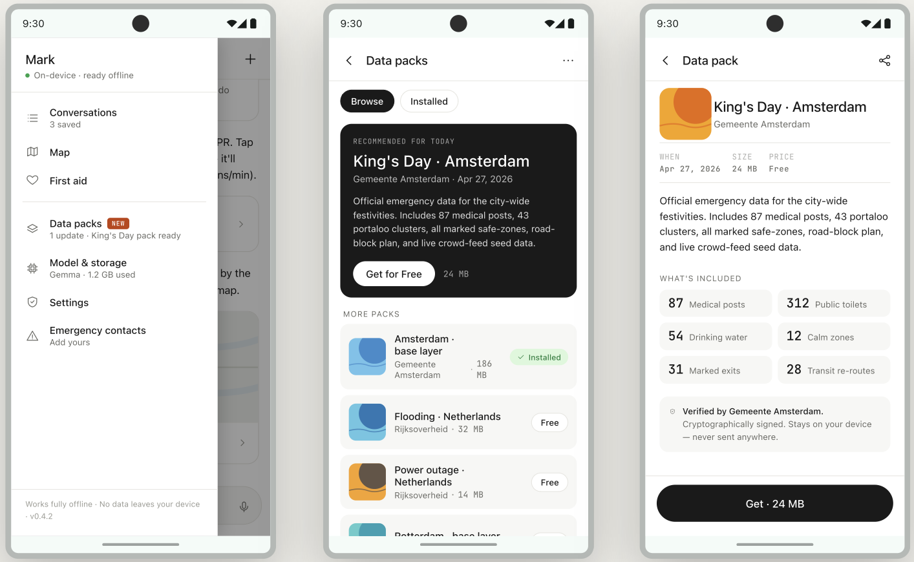
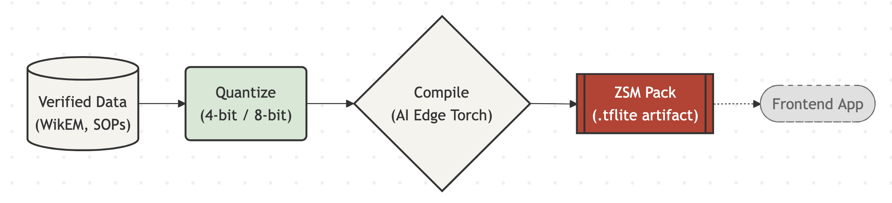

# ZSM — Backend (Packs Pipeline)


ZSM is an offline-first Edge AI app for emergency medical protocols and crises procedures. This repo is the **build-time pipeline** that produces the model and data artifacts the mobile app ships with.

There is no live API. The backend's only job is to compile **Packs** — quantized, on-device-ready bundles consumed by the frontend.

---

## The Result (Frontend Implementation)

From the frontend, you can install different Packs, pulled from the backend. These are curated, relevant data catered to your location and recent events. With this, ZSM can stay up-to-date and offer specialized, local knowledge to aid users as best as possible.

<!-- Replace these with real captures -->


---

## Architecture


The dotted edge is the only contact point between the two halves. Once a Pack is on the device, the app is fully offline.

---

## Pipeline Steps

### 1. Data & SFT
- Ingest verified sources (WikEM dumps, curated medical protocols, survival SOPs).
- Normalize into instruction/response pairs.
- Fine-tune a base SLM (Gemma) with **LoRA** adapters for domain alignment.

```bash
python main.py sft --base gemma-2b --data data/sft.jsonl --out models/lora
```

### 2. Quantization
- Merge LoRA weights into the base model.
- Quantize to **4-bit** or **8-bit** for mobile memory budgets.

```bash
python scripts/quantize.py --in models/merged --bits 4 --out models/quant
```

---

## Repo Layout

```
data/        # source corpora and SFT splits
scrapers/    # ingestion for WikEM and protocol sources
models/      # checkpoints (LoRA, merged, quantized)
rag/         # retrieval index built into each Pack
scripts/     # quantize, compile, pack assembly
packs/       # compiled output artifacts
main.py      # pipeline entrypoint
```

## Requirements

```bash
pip install -r requirements.txt        # training / pipeline
pip install -r requirements-edge.txt   # AI Edge Torch toolchain
```

## Current packs

Current packs: `core_medical`, `amsterdam_basic`, `kings_day_amsterdam`. The frontend lists manifests, downloads the packs it wants, and runs retrieval + inference locally against the shipped model.

## License

MIT.
